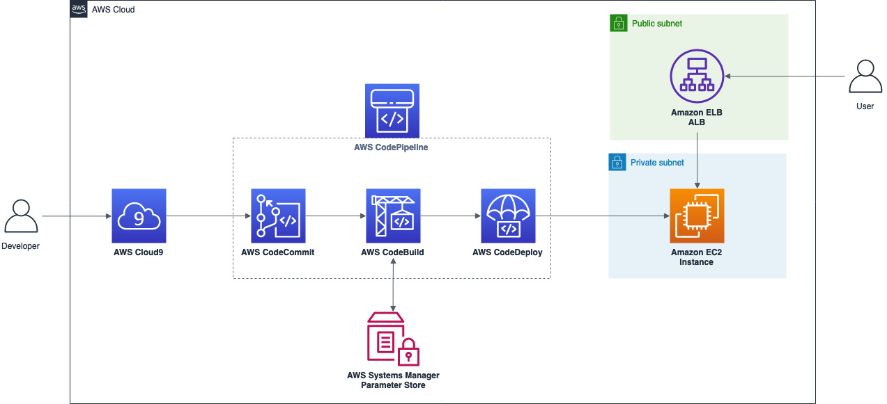

## AWS CI/CD simple Node.js app

The purpose of this demo is show how to use some AWS services for CI/CD. We have a Node.js application utilizing Amazon Rekognition API to identify celebrities and we are going to automatize the source, build and deploy process.




To get started you will need an IAM user with the following access:
- CloudFormation
- Cloud9
- CodeCommit
- CodePipeline
- CodeBuild
- CodeDeploy
- EC2  

_Note: Tested in the N. Virginia region (us-east-1)._

## Key Pairs
1. Open the EC2 console at https://console.aws.amazon.com/ec2
2. In the navigation pane choose **KeyPair**, and create or import a Key Pair named **'cicd-keypair'**
 

## CloudFormation
1. Open the CloudFormation console at https://console.aws.amazon.com/cloudformation
2. On the Welcome page, click on **Create stack** button
3. On the Step 1 - Specify template: Choose Upload a template file, click on **Choose file** button and select the **template.yaml** located inside deploy directory
4. On the Step 2 - Specify stack details: Enter the Stack name as **'cicd-techtalk'**
5. On the Step 3 - Configure stack options: Just click on **Next** button
6. On the Step 4 - Review: Enable the checkbox **I acknowledge that AWS CloudFormation might create IAM resources with custom names.**, and click on **Create Stack** button
7. Wait for the stack get into status **CREATE_COMPLETE**
8. Under the Outputs tab, take a note of **ELB** value
  

## CodeCommit
1. Open the CodeCommit console at https://console.aws.amazon.com/codecommit
2. Click on **Create repository** button, enter the Repostiory name as **'cicd-techtalk'** and then click on **Create** button


## Grant access for CodeCommit on IAM
1. Open the IAM console at https://console.aws.amazon.com/iam
2. In the navigation pane select **Users**, and then click on **awsstudent** username
3. Under Security Credentials tab, click on **Generate** button of section HTTPS Git credentials for AWS CodeCommit
4. Click on **Download credentials** button and save the generated csv file
  

## Setup Cloud9 environment
1. Open the Cloud9 console at https://console.aws.amazon.com/cloud9
2. On the Step 1 - Name environment: Enter the Environment name as **'cicdtech-talk'**
3. On the Step 2 - Configure settings: Just click on **Next** button
4. On the Step 3 - Review: Check the resources being created, and click on **Create Environment** button 
5. Once your envionment was provisioned, select the **bash** tab and execute the following commands:
```
git init
git add .
git commit -m "Repo Init"
git remote add origin https://git-codecommit.us-east-1.amazonaws.com/v1/repos/cicd-techtalk
git push -u origin master
```

_Note: Please note that you'll be asked for the credentials created in the step **Grant access for CodeCommit on IAM**_

## CodeBuild
1. Open the CodeBuild console at https://console.aws.amazon.com/codebuild
2. Click on **Create build project** button
3. Enter the Project name as **'cicd-techtalk'**
4. On Source define **AWS CodeCommit** as the source provider and select **cicd-techtalk** for repository
5. On Environment choose **Ubuntu** for Operational System, **Standard** for Runtime and **aws/codebuild/standard:2.0** as the Image version. After, select **Existing service role** and search for **CodeBuild-cicd-techtalk**
6. Click on **Create build project** button


## CodeDeploy
1. Open the CodeDeploy console at https://console.aws.amazon.com/codedeploy
2. Click on **Create application** button
3. Enter the Application name as **'cicd-techtalk'**, select **EC2/On-premises** for Compute platform and then click on **Create** button
4. Once your application was created, under Deployment groups tab click on **Create deployment group** button
5. Enter the deployment group name as **'cicd-techtalk'**
6. Select the Service Role as **CodeDeploy-cicd-techtalk**
7. On Environment configuration select **Amazon EC2 instances**, enter for Key **'Name'** and for Value **'cicd-techtalk'**
8. On Load Balancer configuration select **cicd-techtalk-tg**
9. Click on **Create deployment group** button
   

## CodePipeline
1. Open the CodePipeline console at https://console.aws.amazon.com/codepipeline
2. Click on **Create pipeline** button
3. On the Step 1 - Choose pipeline setting: Enter the Pipeline name as **'cicd-techtalk'**
3. On the Step 2 - Add source stage:
3.1 Select **AWS CodeCommit** for Source provider
3.2 Select **cicd-techtalk** for Repository name
3.3 Select **master** for Branch name
4. On the Step 3 - Add build stage: Select **AWS Codebuild** for Build provider, and **'cicd-techtalk'** for Project name
5. On the Step 4 - Add deploy stage: Select **AWS CodeDeploy** for Deploy provider, **cicd-techtalk** for Application and Deployment group
6. On the Step 5 - Review: Click on **Create pipeline** button

_Note: The first execution will fail during the build phase, because the project code is not commited yet._


## Setup your Project and push it
1. Open the Cloud9 console at https://console.aws.amazon.com/cloud9
2. Select the **bash** tab and execute the following commands:
```
wget https://github.com/aws-samples/aws-braziltechtalk2019-cicd-demo/zipball/master -O project.zip
unzip project.zip
mv aws-samples-aws-braziltechtalk2019-cicd-demo-*/* .
mv aws-samples-aws-braziltechtalk2019-cicd-demo-*/.gitignore .
rm -fr aws-samples-aws-braziltechtalk2019-cicd-demo-* project.zip
git add .
git commit -m 'project code'
git push 
```

_Note: There is an intentional error on app.js. You can see the error after you launch the application on the first time and click on the button **Find celebrity!**._

## Test and fix your application ##
1. Access your application opening your browser at the ELB DNS retrieved from CoudFormation Outputs
2. Test it using a celebrity picture of your preference and you will receive and error because it cannot find the configuration file
3. Using Cloud9 open the file **app/app.js** and fix the configuration file name on the first modifying it from **<PLEASE-FIX-ME>** to **config**
4. Still on Cloud9, select the **bash** tab and execute the following commands to commit, push your new code and start the pipeline:
```
git add app/app.js
git commit -m "Fix configuration file name"
git push
```
5. Follow the pipeline execution on CodePipeline and wait for the Deploy to be concluded successfully
6. Try again your application!


## Clean up
1. Open the CloudFormation console at https://console.aws.amazon.com/cloudformation
2. Select **cicd-techtalk** Stack and click on **Delete** button


## Reference links
https://docs.aws.amazon.com/codebuild/latest/userguide/sample-codedeploy.html


## License summary
This sample code is made available under the MIT-0 license. See the LICENSE file.